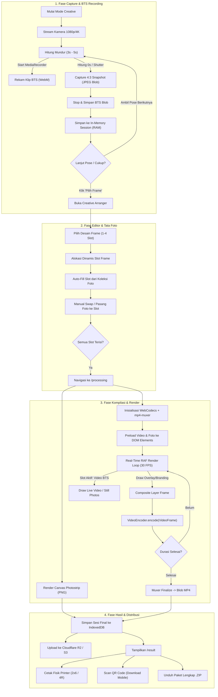

# Spesifikasi & Arsitektur Sistem Creative Mode — ChekiYuume

Dokumen ini menyajikan panduan arsitektur dan spesifikasi teknis mendalam mengenai **Mode Creative (8-Pose Flexible Photobooth)** di aplikasi **ChekiYuume**, mulai dari fase pengambilan foto (*capture*), perekaman video di balik layar (*Behind-The-Scenes / BTS video*), penataan foto (*arranger/editor*), kompilasi video sekuensial (*WebCodecs MP4 compilation*), hingga ekspor dan penyimpanan aset.

Dokumentasi ini dirancang agar mudah dipahami, modular, dan dapat diadaptasi ke berbagai target proyek (web browser, kiosk desktop Windows/Electron/Tauri, maupun native mobile Android WebView/Capacitor).

---

## 1. Konsep & Alur Kerja Inti (Core Concept)

Berbeda dengan **Mode Default** (yang mengunci jumlah pose sejak awal sesuai frame yang dipilih), **Mode Creative** memberikan kebebasan penuh kepada pengunjung:

1. **Flexible Multi-Pose Capture**: Pengunjung dapat mengambil foto bertahap hingga maksimal **8 pose** (dengan opsi melanjutkan kapan saja mulai dari minimal 1 foto).
2. **Multi-Track BTS Recording**: Selama hitung mundur (*countdown*) pada setiap pose, sistem secara independen merekam klip video cuplikan ekspresi dan pose pengunjung.
3. **Post-Capture Framing & Photo Arranger**: Pengunjung bebas memilih tema desain frame (1 slot, 2 slot, 3 slot, atau 4 slot) **setelah foto diambil**, kemudian menata foto terbaik ke dalam slot yang diinginkan.
4. **Synchronous Photostrip & Sequential Videostrip**: Menghasilkan 2 output utama yang sinkron orientasi cerminnya (*mirror-aligned*):
   - **Photostrip 2D**: Foto kolase beresolusi tinggi (300 DPI siap cetak).
   - **Sequential Videostrip MP4**: Video bergerak di mana setiap slot foto beranimasi secara bergantian sesuai video BTS pose tersebut.

---

## 2. Diagram Alur Sistem (End-to-End Pipeline)



---

## 3. Rincian Teknis Per Komponen

### Komponen A: Layanan Kamera & Perekam BTS (`camera.ts`)

Layanan kamera mengelola *input media stream*, pemotongan rasio 4:3 (*aspect-fill crop*), dan perekaman video klip BTS.

```typescript
// Konfigurasi Constraints Media Kamera
const videoConstraints: MediaTrackConstraints = {
    width: { ideal: 1920 },
    height: { ideal: 1080 },
    frameRate: { ideal: 30, max: 60 },
    facingMode: 'user'
};
```

#### 1. Snapshot Foto 4:3 Center Crop
Sensor kamera umumnya menghasilkan rasio 16:9 (1920×1080). Untuk mencocokkan dengan slot photostrip standar (4:3):
$$\text{targetAspect} = \frac{4}{3} = 1.333$$
$$\text{cropWidth} = \text{videoHeight} \times \text{targetAspect}$$
$$\text{sx} = \frac{\text{videoWidth} - \text{cropWidth}}{2}, \quad \text{sy} = 0$$

Jika mode cermin (*mirroring*) aktif:
```typescript
if (isMirrored) {
    ctx.translate(canvas.width, 0);
    ctx.scale(-1, 1);
}
ctx.drawImage(videoElement, sx, sy, cropWidth, cropHeight, 0, 0, canvas.width, canvas.height);
```

#### 2. Perekaman Klip BTS Video
Saat hitung mundur dimulai, `cameraService.startBtsRecording()` mengaktifkan `MediaRecorder` dengan format `video/webm;codecs=vp9` (atau fallback `vp8`). Perekaman dihentikan tepat saat shutter berkedip, menghasilkan file video WebM pendek (3–5 detik) berisi gerakan ekspresi pengunjung saat bersiap.

---

### Komponen B: Manajemen State & Anti-Memory Leak (`session.ts`)

#### Kebijakan Penyimpanan Memori:
- **In-Memory Store (RAM Svelte Store)**: Menyimpan objek `PhotoItem` (dataURL JPEG, Blob Foto, dan Blob Video BTS). Akses data instan 60 FPS tanpa jeda I/O.
- **SessionStorage (Metadata Only)**: Hanya menyimpan data ringan seperti `sessionId`, `guestName`, `layoutId`, dan `mode`.
- **IndexedDB (Permanent Storage)**: Sesi **hanya disimpan ke IndexedDB saat mencapai `/result`** untuk mencegah penumpukan sampah dari sesi yang dibatalkan di tengah jalan.

---

### Komponen C: Editor & Interactive Frame Arranger (`CreativeArranger.svelte`)

Pada fase editor:
1. **Dynamic Frame Switching**: Pengunjung dapat mengganti frame dari 4-slot ke 2-slot atau 3-slot secara instan.
2. **Array Re-Allocation Safety**: Saat jumlah slot berubah:
   ```typescript
   const count = layout.totalSlots;
   const newAssigned = new Array(count).fill(null);
   for (let i = 0; i < count; i++) {
       newAssigned[i] = existingAssigned[i] || availablePhotos[i]?.id || null;
   }
   ```
3. **WYSIWYG Coordinate Mapping**: Pratinjau di layar menggunakan sistem persentase koordinat yang 100% identik dengan hasil kanvas akhir:
   $$\text{left} = \left(\frac{\text{slot.x}}{\text{canvasWidth}}\right) \times 100\%$$
   $$\text{top} = \left(\frac{\text{slot.y}}{\text{canvasHeight}}\right) \times 100\%$$
   $$\text{width} = \left(\frac{\text{slot.width}}{\text{canvasWidth}}\right) \times 100\%$$
   $$\text{height} = \left(\frac{\text{slot.height}}{\text{canvasHeight}}\right) \times 100\%$$

---

### Komponen D: Mesin Kompilasi Videostrip Sekuensial (`videoCompiler.ts`)

Kompilasi videostrip menggunakan teknologi **WebCodecs API (`VideoEncoder`)** yang digabungkan dengan **`mp4-muxer`** untuk menghasilkan berkas `.mp4` standar (H.264 / AVC) yang dapat diputar di semua perangkat seluler (iOS & Android).

#### 1. Arsitektur Playback Real-Time (`requestAnimationFrame`)
Untuk mencegah masalah *stuck frame*, elemen `<video>` dimuat ke dalam memori DOM dan diputar secara aktif (`video.play()`). Loop RAF menangkap frame kanvas pada 30 FPS secara *real-time*.

#### 2. Penanganan Durasi Dinamis & Safe PlaybackRate Guard
Pada video WebM hasil rekaman `MediaRecorder`, browser Chromium tidak menyertakan durasi statis pada header blob sehingga `video.duration` terbaca `Infinity` atau `NaN`. Solusi proteksi:

```typescript
const segmentDuration = (countdownSeconds && Number.isFinite(countdownSeconds)) 
    ? countdownSeconds 
    : 5.0;

preloadedVideos.forEach((vid) => {
    try {
        if (Number.isFinite(vid.duration) && vid.duration > 0 && segmentDuration > 0) {
            const rate = vid.duration / segmentDuration;
            if (Number.isFinite(rate) && rate > 0.1 && rate < 10) {
                vid.playbackRate = rate;
                return;
            }
        }
        vid.playbackRate = 1.0;
    } catch {
        vid.playbackRate = 1.0;
    }
});
```

#### 3. Logika Urutan Animasi Slot (Sequential Pass)
- **Slot 1 Aktif** (Detik 0 s/d 5): Slot 1 memutar video BTS klip 1 (dengan *mirror sync*), sedangkan Slot 2, 3, 4 menampilkan foto diam (*still photo*).
- **Slot 2 Aktif** (Detik 5 s/d 10): Slot 2 memutar video BTS klip 2, sedangkan Slot 1, 3, 4 menampilkan foto diam.
- **Slot 3 Aktif** (Detik 10 s/d 15): Slot 3 memutar video BTS klip 3, slot lainnya diam.
- **Slot 4 Aktif** (Detik 15 s/d 20): Slot 4 memutar video BTS klip 4, slot lainnya diam.

---

## 4. Panduan Adaptasi & Parameter Konfigurasi Proyek

Jika ingin mengadaptasi sistem ini ke proyek baru atau environment lain, sesuaikan variabel konfigurasi berikut:

| Parameter | File Lokasi | Nilai Default | Keterangan |
| :--- | :--- | :--- | :--- |
| **Max Photos Allowed** | `CreativeCaptureFlow.svelte` | `8` | Jumlah maksimum foto yang dapat diambil sebelum memilih frame. |
| **Slot Canvas Dimensions** | `frameLayouts.ts` | `1200 × 3600 px` | Resolusi kanvas standar untuk strip foto 2×6 inch (300 DPI). |
| **Countdown Duration** | `settings.ts` | `5 detik` | Durasi hitung mundur per pose & durasi video BTS per slot. |
| **Video Compilation FPS** | `videoCompiler.ts` | `30 FPS` | Frame rate output video MP4. |
| **Video Bitrate** | `videoCompiler.ts` | `5,000,000 bps` | Bitrate H.264 (kualitas tinggi tanpa lag di HP). |
| **Mirror Mode Sync** | `settings.ts` / `videoCompiler.ts` | `true` | Menjaga arah orientasi gerakan video sama persis dengan foto cermin. |

---

## 5. Struktur Penyimpanan Aset (ZIP Package & Cloud R2)

Setiap sesi menghasilkan paket terstruktur yang dapat diunduh operator atau dikirim ke Cloudflare R2:

```text
[sessionId]/
├── photostrip.png          # Hasil kolase akhir siap cetak (High-res)
├── videostrip.mp4          # Video animasi sekuensial H.264 MP4
├── manifest.json           # Metadata (Tamu, Waktu, Layout, Mode)
├── raw_photos/             # Snapshot asli kamera tanpa kompresi
│   ├── photo_1.jpg
│   ├── photo_2.jpg
│   └── ...
└── bts_videos/             # Klip rekaman video mentah tiap countdown
    ├── bts_1.webm
    ├── bts_2.webm
    └── ...
```

---

## 6. Ringkasan Keunggulan Arsitektur

1. **Performa Tinggi**: Menggunakan *hardware-accelerated WebCodecs* sehingga render video 15 detik selesai dalam hitungan detik tanpa memblokir antarmuka pengguna.
2. **Zero Waste Storage**: Sesi yang dibatalkan tidak meninggalkan file sampah di database lokal.
3. **True WYSIWYG**: Koordinat slot kanvas dihitung berbasis persentase matematis, menjamin akurasi antara layar pratinjau dan hasil cetak fisik.
4. **Cross-Platform Ready**: Format MP4 AVC Level 5.1/4.0 kompatibel secara native dengan Safari iOS, Chrome Android, Instagram Story, dan WhatsApp.
